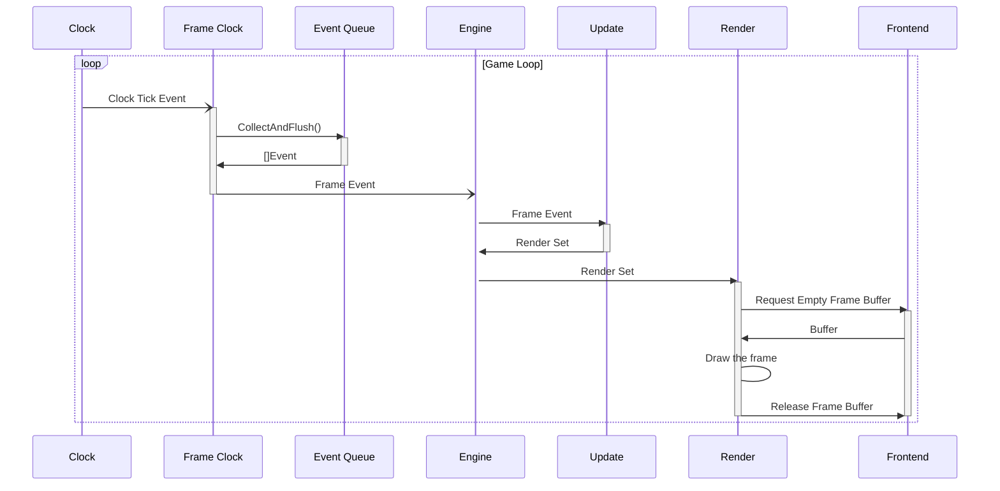

# bit

An experimental 2D game engine I'm writing just for fun.

## Architecture Notes

```mermaid
sequenceDiagram
  participant Clock
  participant Frame Clock
  participant Event Queue
  loop Game Loop
    Clock-)Frame Clock: Clock Tick Event
    activate Frame Clock
    Frame Clock ->> Event Queue: CollectAndFlush()
    activate Event Queue
    Event Queue ->> Frame Clock: []Event
    deactivate Event Queue
    Frame Clock -) Engine: Frame Event
    activate Engine
    deactivate Frame Clock
    Engine ->> Update: Frame Event
    activate Update
    Update ->> Engine: Render Set
    deactivate Update
    Engine ->> Render: Render Set
    activate Render
    Render ->> Frontend: Request Empty Frame Buffer
    activate Frontend
    Frontend ->> Render: Buffer
    Render -> Render: Draw the frame
    Render ->> Frontend: Release Frame Buffer
    deactivate Render
    deactivate Frontend
  end
```
